<div align="center">

# JevSpan

**Zero-shot named entity recognition built on [TypeSafe Jev](https://typesafe.ai).**<br/>
Describe your entity types in one line each. No training data, no GPU, no fine-tuning.

[](LICENSE)


**English** · [简体中文](README.zh-CN.md)

</div>

---

Jev answers typed multiple-choice questions with calibrated probabilities, but it never returns entity spans on its own. **JevSpan turns it into an entity recognizer.** It cuts text at punctuation, offers every candidate window to Jev as an option, verifies what Jev nominates, and then lets Jev settle the exact boundaries and type. Every entity comes back with a probability and a trace of the questions that produced it.

On **12 public NER benchmarks** (Chinese, English, and the five CrossNER domains), JevSpan averages **73.7 strict F1 fully zero-shot**. That is 1.6 points above prompting **Qwen3.8-27B** with the same type descriptions, at a third of its latency, and about 20 points above GLiNER and NuNER.

```text
$ jevspan "昨天下午，张伟教授在清华大学主楼作了报告，随后前往北京市海淀区中关村大街27号参观。"
人名    张伟                        [5,7)     …
机构    清华大学                    [10,14)   …
地址    北京市海淀区中关村大街27号    [25,39)   …
```

<sub>Each line is type, text, character offsets, then Jev's score and where the entity came from (trimmed here).</sub>

## Why JevSpan

- **Any entity type, defined in plain words.** A type is a name, a one-line description, and optionally a few examples and counter-examples. Switch from people and companies to drugs, product models, or legal clauses by editing a JSON file.
- **Accurate without training.** 73.7 strict F1 across 12 benchmarks with no labelled data, ahead of a 27B LLM doing direct extraction.
- **Nothing to host.** The client is plain HTTPS. There are no weights to download and no GPU to rent.
- **Scores you can threshold, decisions you can audit.** Each entity carries Jev's probability. `--trace` shows every segment, candidate, and verdict, and the web UI draws the full decision tree.
- **Chinese first, English too.** Segmentation understands CJK punctuation, full-width brackets, book-title marks, and space-delimited Latin text.

## Benchmark

Every method sees the same 200 test sentences per dataset (fixed seed) and the same type descriptions. Strict F1 requires exact boundaries and the exact type.

| Method | Training data | Avg strict F1 (12 sets) | Avg (8 English sets) | Latency / doc | Cost / 1k docs | Runs on |
|---|---|---:|---:|---:|---:|---|
| **JevSpan (Jev 1.13)** | none | **73.7** | **73.9** | **0.53 s** | $0.64 | Jev API |
| Qwen3.8-27B, direct extraction | none | 72.1 | 73.8 | 1.65 s | $0.28 | DashScope API |
| Qwen3-8B, direct extraction | none | 55.7 | 55.9 | 1.10 s | ~$0.004 | RTX 3090 |
| GLiNER2.5-multi | none | 50.4 | 54.4 | 0.02 s | ~$0.001 | GPU or CPU |
| GLiNER-multi v2.1 | none | 47.0 | 55.0 | 0.02 s | ~$0.001 | GPU or CPU |
| GLiNER-large v2.1 (English only) | none | – | 56.3 | 0.03 s | ~$0.002 | GPU or CPU |
| NuNER-Zero (English only) | none | – | 56.4 | 0.03 s | ~$0.002 | GPU or CPU |
| Fine-tuned BERT / RoBERTa | 1.4k–45k labelled sentences | – | – | 0.01 s | ~$0.001 | GPU or CPU |

<details>
<summary><b>Strict F1 per dataset</b></summary>

| Method | MSRA | Resume | CLUENER | Weibo | CoNLL03 | WNUT17 | MIT-Rest | CN-AI | CN-Lit | CN-Music | CN-Pol | CN-Sci |
|---|---:|---:|---:|---:|---:|---:|---:|---:|---:|---:|---:|---:|
| **JevSpan** | **82.1** | 88.4 | **67.5** | **55.4** | 82.0 | **56.6** | 65.4 | **72.0** | **74.8** | 79.9 | **83.2** | **77.7** |
| Qwen3.8-27B | 72.0 | **90.0** | 63.6 | 48.9 | **86.2** | 54.0 | **73.8** | 69.2 | 72.5 | **81.0** | 76.8 | 76.9 |
| Qwen3-8B | 62.2 | 68.5 | 55.9 | 35.5 | 74.8 | 38.8 | 43.4 | 53.2 | 52.4 | 70.7 | 56.5 | 57.2 |
| GLiNER2.5-multi | 55.2 | 56.2 | 31.1 | 27.9 | 64.5 | 51.4 | 44.1 | 43.3 | 56.4 | 64.1 | 58.7 | 52.5 |
| GLiNER-multi v2.1 | 50.5 | 21.1 | 30.3 | 22.5 | 58.4 | 43.3 | 27.8 | 47.3 | 62.6 | 71.5 | 66.5 | 62.3 |
| NuNER-Zero | – | – | – | – | 59.1 | 41.6 | 35.9 | 50.7 | 60.4 | 70.2 | 72.3 | 60.8 |
| Fine-tuned (supervised) | 96.7 | 96.0 | 69.9 | 63.4 | 93.0 | 59.1 | 82.0 | – | – | – | – | – |

Bold marks the best zero-shot score. Relaxed F1, precision, recall, per-dataset latency and cost, and hardware requirements are in [`bench/results/FINAL_REPORT.md`](bench/results/FINAL_REPORT.md).

</details>

**How to read it**

- **Against Qwen3.8-27B:** JevSpan leads by 10 points on MSRA, 6.5 on Weibo, 6.4 on CrossNER politics, and 3.9 on CLUENER. It trails on CoNLL (−4.2) and MIT Restaurant (−8.4). It is about 3× faster per document and costs about 2.3× more.
- **Against small open zero-shot models:** about 20 points ahead of GLiNER and NuNER, at API latency rather than local-GPU latency.
- **Against fine-tuned models:** if you have thousands of labelled sentences for a fixed label set, a fine-tuned encoder is still more accurate and far cheaper. JevSpan is for when you don't, or when the types keep changing.

<sub>Jev latency and cost: 30 sentences per dataset, no cache, one document at a time, at $0.042 per million input tokens. Qwen3.8-27B: DashScope Beijing list price, thinking disabled, 8 concurrent requests. Local models: RTX 3090, cost from rental price. Measured September 2026 with `jev-1.13.0`.</sub>

## Quick start

You need Python 3.12+, [uv](https://docs.astral.sh/uv/), and a TypeSafe API key from [console.typesafe.ai](https://console.typesafe.ai).

```bash
git clone https://github.com/<owner>/jevspan.git
cd jevspan
uv sync
echo 'TYPESAFE_API_KEY=your-key' > .env    # .env is git-ignored

uv run jevspan "Tim Cook announced that Apple will open a new office in Austin, Texas."
uv run jevspan-web                         # http://127.0.0.1:47321
```

Every Jev answer is cached in `.cache/jev.sqlite`, so repeating a run is free.

## Define your own entity types

A schema is a JSON object. Each type needs a `description`; `title`, `examples`, and `counter_examples` are optional.

```json
{
  "entities": {
    "drug":    { "title": "Drug", "description": "a medicine's generic or brand name, including its dosage form",
                 "examples": ["amoxicillin", "ibuprofen extended-release capsules"] },
    "disease": { "title": "Disease", "description": "a diagnosed disease or condition, not a symptom",
                 "examples": ["hypertension", "type 2 diabetes"],
                 "counter_examples": ["cough", "fever"] },
    "exam":    { "title": "Exam", "description": "a lab test or imaging examination",
                 "examples": ["complete blood count", "chest CT"] }
  }
}
```

```bash
uv run jevspan --schema my_schema.json -f notes.txt
```

**The biggest accuracy lever is the boundary convention.** State what a type includes and excludes, and back it with a counter-example. On a small e-commerce set, one added sentence ("a model name excludes the product category and version suffix; a price excludes 'about'") raised strict F1 from 0.778 to 0.945. Ready-made schemas live in [`eval/schemas/`](eval/schemas), [`src/jevspan/presets/`](src/jevspan/presets), and one per benchmark in [`bench/schemas/`](bench/schemas).

Other optional fields: `include_brackets` (keep surrounding 《》 for book or film titles) and `min_chars` (default 2; set it to 1 for single-character entities). A shorthand `{"drug": "a medicine's name"}` also works.

## Use it from Python

```python
import asyncio
from jevspan import JevClient, Recognizer, Schema

schema = Schema.from_dict({
    "brand":   {"title": "Brand", "description": "the manufacturer or brand of a product", "examples": ["Apple", "Nike"]},
    "product": {"title": "Model", "description": "a specific product model, without brand or category words",
                "examples": ["iPhone 15", "Air Force 1"]},
    "price":   {"title": "Price", "description": "an amount of money with its unit", "examples": ["599 yuan", "$19.99"]},
})

async def main() -> None:
    async with JevClient() as client:                      # reads TYPESAFE_API_KEY
        recognizer = Recognizer.from_preset(client, "accurate", schema=schema)
        result = await recognizer.recognize("Nike Air Force 1 in white, was 899 yuan, now 599 yuan.")
        for e in result.entities:
            print(e.label, e.text, (e.start, e.end), f"{e.score:.2f}", e.source)
        print(client.usage.as_dict())                      # requests, tokens, cost in USD

asyncio.run(main())
```

`result.entities` holds `text`, `label`, `start`, `end` (character offsets), `score` (Jev's probability for the winning label), and `source` (`window`, `segment`, or `propagated`). `result.trace` is the full decision tree. `result.as_dict()` gives JSON-ready output.

## Command line

```bash
uv run jevspan "text"                    # or -f file.txt, or pipe through stdin
uv run jevspan --json "text"             # JSON output with token usage
uv run jevspan --trace "text"            # print every segment, candidate, and verdict
```

| Option | What it does |
|---|---|
| `--schema FILE` | Zero-shot entity types (default: person, organization, address) |
| `--preset accurate\|balanced\|legacy` | `accurate` is the default. `balanced` is about 25% cheaper with slightly lower recall. `legacy` is the original hierarchical pipeline. |
| `--min-score X` | Only output entities whose score is at least `X` |
| `--no-context` | Don't send the surrounding sentence to Jev |
| `--no-propagate` | Skip the document-wide pass for repeated mentions |
| `--model NAME` | Pin a Jev version, e.g. `jev-1.13.0` |
| `--no-cache`, `--cache PATH` | Control the local answer cache |

Environment variables: `TYPESAFE_API_KEY` (or `JEV_API_KEY`), `TYPESAFE_BASE_URL`, `TYPESAFE_DEFAULT_MODEL`, and `HOST` / `PORT` for the web UI.

## Web UI

`uv run jevspan-web` serves a small app at `http://127.0.0.1:47321`. Paste text, pick a preset (people, organizations and addresses; medical; e-commerce) or edit the schema JSON, and see the highlighted entities, a result table, token usage, and the decision tree that led to each answer. The interface is in Chinese.

## How it works

```mermaid
flowchart LR
    T[Text] --> S[Sentences]
    S --> C["Clauses<br/>split at ，、：；"]
    C --> N{{"Jev multiple choice:<br/>which window is exactly<br/>one complete X?"}}
    N -->|nominated windows| V{{"Jev verifies each window:<br/>type / none / mixed / partial"}}
    V -.->|"types that found something<br/>ask again without their picks"| N
    V -->|accepted| P{{"Jev polishes:<br/>boundary variants + retype"}}
    P --> O[Resolve overlaps]
    O --> G{{"Propagate: verify repeated<br/>mentions in their own sentence"}}
    G --> R["Entities + scores + trace"]
```



1. **Segment.** Split the text into sentences, then into clauses at commas, enumeration commas, colons, and semicolons. Each sentence is sent to Jev as context.
2. **Nominate.** Every character or word window of a clause becomes an option in a single Jev `choice` question: "Which option is exactly one complete *drug*? If none, answer NONE." Types are asked in groups of up to four. Windows that start or end on function words are pruned first, and questions with more than 255 options are split.
3. **Verify.** Each nominated window gets its own question with the labels *your types*, `none`, `mixed` (contains an entity plus other words), and `partial` (a truncated entity). The highest-probability label decides.
4. **Ask again.** A single-answer question puts its probability on the most salient option. In "US President Biden met Japanese Prime Minister Kishida in Washington", the first round gives Washington 0.87 and the United States almost nothing. Any type that found something is asked again without its picks. Verification of one round shares a request with the next round's nomination, so extra rounds cost one round trip, not two.
5. **Polish.** Jev picks the exact boundary from the entity and variants trimmed by up to three units or extended by up to two, then re-decides the type. The new type is fused with the verification probabilities at weight 0.7.
6. **Propagate.** Every recognized surface form is searched for in the rest of the document, and each further occurrence is verified in its own sentence.

Throughout, requests are batched: many questions about the same sentence travel in one Jev call, and the client retries 429, 529, and 5xx responses with backoff.

## Reproduce the benchmark

The public datasets are not redistributed here. Two commands rebuild the exact 200-sentence test samples:

```bash
bench/download.sh                       # ~60 MB from Hugging Face into bench/data/
uv run python bench/prepare.py          # writes bench/sets/<name>_{dev,test}.jsonl, seed 2026
```

Then run the methods you care about and regenerate the report:

```bash
uv run python bench/run_jev.py --split test --tag accurate
uv run python bench/run_jev.py --split test --limit 30 --no-cache --concurrency 1 --tag seq_accurate
QWEN_API_KEY=... uv run python bench/llm_api_baseline.py --model qwen3.8-27b
python bench/baselines_gpu.py --methods all          # GPU box with torch, transformers, gliner, gliner2
python bench/llm_baseline.py --model Qwen/Qwen3-8B   # GPU box with vLLM
uv run python bench/final_report.py > bench/results/FINAL_REPORT.md
```

`bench/results/` ships the aggregate metrics behind every number above. Per-sentence predictions are left out because they quote the datasets.

The hand-written development sets in [`eval/`](eval) (70 sentences of people, organizations and addresses, plus small medical and e-commerce sets) run with `uv run python eval/evaluate.py`. The offline unit tests need no key: `uv run pytest`.

## Limitations

- **Spans come from the segmenter.** Jev only scores candidates, so an entity that no window covers cannot be found. Noisy social-media text (Weibo 55.4, WNUT 56.6) is where this ceiling shows most.
- **It needs a network call.** Latency is about half a second per sentence-sized document. For millions of documents with a fixed label set, a fine-tuned encoder is faster and cheaper.
- **Results move slightly between runs.** Jev's probabilities vary by about ±0.05, so close calls can flip. Pin the model version if you tune thresholds.
- **Annotation conventions differ between datasets.** Whether a hotel is an organization or a location, or whether "Dr." belongs to a name, depends on the guideline. Write your convention into the schema.

## Project layout

```text
src/jevspan/
  segmenter.py     sentence / clause / bracket / space levels and window units
  recognizer.py    nomination, verification, polishing, propagation, presets
  schema.py        zero-shot entity type definitions
  jev_client.py    async Jev client: batching, retries, cache, usage and cost
  cli.py, web.py   command line and web UI (static/, presets/)
eval/              hand-written evaluation sets, schemas, evaluate.py
bench/             dataset download and sampling, baselines, report generator, results
tests/             offline unit tests
```

## Disclaimer

JevSpan is an independent open-source project. It is not affiliated with or endorsed by TypeSafe AI. Using it requires your own Jev API key and is subject to TypeSafe's terms of service. Benchmark datasets keep their original licenses.

## License

[MIT](LICENSE)
