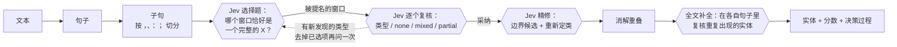

<div align="center">

# JevSpan

**基于 [TypeSafe Jev](https://typesafe.ai) 的零样本实体识别。**<br/>
每种实体类型用一句话描述即可。不需要标注数据，不需要 GPU，不需要微调。

[](LICENSE)


[English](README.md) · **简体中文**

</div>

---

Jev 能回答带类型的选择题，并给出校准过的概率，但它自己不会返回实体的起止位置。**JevSpan 把它变成一个实体识别器。** 它按标点切分文本，把所有候选窗口作为选项交给 Jev，复核 Jev 提名的候选，再让 Jev 定下准确的边界和类型。每个实体都带着概率，以及产生它的完整问答过程。

在 **12 个公开 NER 数据集**（中文、英文和 CrossNER 的 5 个领域）上，JevSpan **完全零样本**，严格 F1 平均 **73.7**。用同样的类型描述直接让 **Qwen3.8-27B** 抽取，平均是 72.1；JevSpan 高 1.6 个点，单条延迟只有它的 1/3，比 GLiNER 和 NuNER 高约 20 个点。

```text
$ jevspan "昨天下午，张伟教授在清华大学主楼作了报告，随后前往北京市海淀区中关村大街27号参观。"
人名    张伟                        [5,7)     …
机构    清华大学                    [10,14)   …
地址    北京市海淀区中关村大街27号    [25,39)   …
```

<sub>每行依次是类型、文本、字符位置，后面还有 Jev 的分数和实体来源（这里省略）。</sub>

## 为什么用 JevSpan

- **任意实体类型，用大白话定义。** 一个类型就是一个名字、一句描述，再加几个可选的正例和反例。从人名、公司换成药品、产品型号或合同条款，只要改一个 JSON 文件。
- **不训练也准。** 12 个数据集上零样本严格 F1 平均 73.7，高于直接抽取的 27B 大模型。
- **什么都不用部署。** 客户端只是 HTTPS 调用，不用下载权重，也不用租 GPU。
- **分数可以卡阈值，判断可以追溯。** 每个实体都带 Jev 的概率。`--trace` 会打印每个片段、候选和判断；网页界面会画出完整的决策树。
- **中文优先，也支持英文。** 切分规则认识中文标点、全角括号、书名号，以及用空格分词的拉丁文字。

## 基准测试

所有方法都是零样本，用同一批测试句（每个数据集 200 条，固定随机种子）和同样的类型描述。严格 F1 要求边界和类型都完全正确。

| 方法 | 严格 F1：12 集平均 | 8 个英文集平均 | 单条延迟 | 每千条成本 | 运行环境 |
|---|---:|---:|---:|---:|---|
| **JevSpan（Jev 1.13）** | **73.7** | **73.9** | **0.53 秒** | $0.64 | Jev API |
| Qwen3.8-27B 直接抽取 | 72.1 | 73.8 | 1.65 秒 | $0.28 | 百炼 API |
| Qwen3-8B 直接抽取 | 55.7 | 55.9 | 1.10 秒 | ~$0.004 | RTX 3090 |
| GLiNER2.5-multi | 50.4 | 54.4 | 0.02 秒 | ~$0.001 | GPU 或 CPU |
| GLiNER-multi v2.1 | 47.0 | 55.0 | 0.02 秒 | ~$0.001 | GPU 或 CPU |
| GLiNER-large v2.1（仅英文） | – | 56.3 | 0.03 秒 | ~$0.002 | GPU 或 CPU |
| NuNER-Zero（仅英文） | – | 56.4 | 0.03 秒 | ~$0.002 | GPU 或 CPU |

<details>
<summary><b>各数据集严格 F1</b></summary>

| 方法 | MSRA | Resume | CLUENER | Weibo | CoNLL03 | WNUT17 | MIT-Rest | CN-AI | CN-文学 | CN-音乐 | CN-政治 | CN-科学 |
|---|---:|---:|---:|---:|---:|---:|---:|---:|---:|---:|---:|---:|
| **JevSpan** | **82.1** | 88.4 | **67.5** | **55.4** | 82.0 | **56.6** | 65.4 | **72.0** | **74.8** | 79.9 | **83.2** | **77.7** |
| Qwen3.8-27B | 72.0 | **90.0** | 63.6 | 48.9 | **86.2** | 54.0 | **73.8** | 69.2 | 72.5 | **81.0** | 76.8 | 76.9 |
| Qwen3-8B | 62.2 | 68.5 | 55.9 | 35.5 | 74.8 | 38.8 | 43.4 | 53.2 | 52.4 | 70.7 | 56.5 | 57.2 |
| GLiNER2.5-multi | 55.2 | 56.2 | 31.1 | 27.9 | 64.5 | 51.4 | 44.1 | 43.3 | 56.4 | 64.1 | 58.7 | 52.5 |
| GLiNER-multi v2.1 | 50.5 | 21.1 | 30.3 | 22.5 | 58.4 | 43.3 | 27.8 | 47.3 | 62.6 | 71.5 | 66.5 | 62.3 |
| NuNER-Zero | – | – | – | – | 59.1 | 41.6 | 35.9 | 50.7 | 60.4 | 70.2 | 72.3 | 60.8 |

加粗是每个数据集的最高分。宽松 F1、精确率、召回率、各数据集的延迟和成本，以及硬件需求，见 [`bench/results/FINAL_REPORT.md`](bench/results/FINAL_REPORT.md)。

</details>

**怎么看这些结果**

- **和 Qwen3.8-27B 比：** MSRA 高 10 个点，Weibo 高 6.5 个点，CrossNER 政治高 6.4 个点，CLUENER 高 3.9 个点；CoNLL 低 4.2 个点，MIT Restaurant 低 8.4 个点。单条速度快约 3 倍，成本约为它的 2.3 倍。
- **和开源零样本小模型比：** 比 GLiNER、NuNER 高约 20 个点，代价是 API 级的延迟，而不是本地 GPU 的毫秒级延迟。

<sub>Jev 的延迟和成本：每个数据集 30 条，不用缓存，一次处理一条，按每百万输入 token $0.042 计费。Qwen3.8-27B：百炼北京区公开价格，关闭思考，8 路并发。本地模型：RTX 3090，按租用价格折算。2026 年 9 月使用 `jev-1.13.0` 测得。</sub>

## 快速开始

需要 Python 3.12+、[uv](https://docs.astral.sh/uv/)，以及在 [console.typesafe.ai](https://console.typesafe.ai) 申请的 TypeSafe API key。

```bash
git clone https://github.com/lzq-0529/jev-span.git
cd jev-span
uv sync
echo 'TYPESAFE_API_KEY=你的key' > .env      # .env 已被 git 忽略

uv run jevspan "联系人：王建国，就职于深圳市腾讯计算机系统有限公司。"
uv run jevspan-web                          # http://127.0.0.1:47321
```

所有 Jev 回答都缓存在 `.cache/jev.sqlite`，重复运行不会再计费。

## 自定义实体类型

schema 是一个 JSON 对象。每个类型必须有 `description`；`title`、`examples` 和 `counter_examples` 可选。

```json
{
  "entities": {
    "drug":    { "title": "药品", "description": "药物或药品的名称，包括通用名、商品名和剂型",
                 "examples": ["阿莫西林", "布洛芬缓释胶囊"] },
    "disease": { "title": "疾病", "description": "疾病、诊断或病症的名称",
                 "examples": ["高血压", "2型糖尿病"],
                 "counter_examples": ["咳嗽", "发烧"] },
    "exam":    { "title": "检查项目", "description": "医学检查、化验或影像检查项目的名称",
                 "examples": ["血常规", "胸部CT"] }
  }
}
```

```bash
uv run jevspan --schema my_schema.json -f notes.txt
```

**对准确率影响最大的是边界约定。** 写清楚这个类型包含什么、不包含什么，再配一个反例。在一个电商小数据集上，只加一句「型号不含品类词和版本后缀，价格不含'约'」，严格 F1 就从 0.778 升到 0.945。现成的 schema 在 [`eval/schemas/`](eval/schemas)、[`src/jevspan/presets/`](src/jevspan/presets)，每个基准数据集的 schema 在 [`bench/schemas/`](bench/schemas)。

其他可选字段：`include_brackets`（书名、电影名等保留外面的《》）和 `min_chars`（默认 2；单字实体设为 1）。也支持简写 `{"drug": "药品的名称"}`。

## 在 Python 里使用

```python
import asyncio
from jevspan import JevClient, Recognizer, Schema

schema = Schema.from_dict({
    "brand":   {"title": "品牌", "description": "商品的品牌或厂商", "examples": ["苹果", "Nike"]},
    "product": {"title": "产品型号", "description": "具体型号，不含品牌和品类词", "examples": ["iPhone 15", "Air Force 1"]},
    "price":   {"title": "价格", "description": "带单位的金额，不含'约'", "examples": ["599元", "$19.99"]},
})

async def main() -> None:
    async with JevClient() as client:                      # 读取 TYPESAFE_API_KEY
        recognizer = Recognizer.from_preset(client, "accurate", schema=schema)
        result = await recognizer.recognize("耐克Air Force 1白色款，原价899元，现价599元。")
        for e in result.entities:
            print(e.label, e.text, (e.start, e.end), f"{e.score:.2f}", e.source)
        print(client.usage.as_dict())                      # 请求数、token 数、美元费用

asyncio.run(main())
```

`result.entities` 里每个实体有 `text`、`label`、`start`、`end`（字符位置）、`score`（Jev 给最终标签的概率）和 `source`（`window`、`segment` 或 `propagated`）。`result.trace` 是完整的决策树，`result.as_dict()` 直接得到可序列化的 JSON。

## 命令行

```bash
uv run jevspan "文本"                     # 也可以用 -f file.txt，或从 stdin 读入
uv run jevspan --json "文本"              # 输出 JSON，附带 token 用量
uv run jevspan --trace "文本"             # 打印每个片段、候选和判断
```

| 参数 | 作用 |
|---|---|
| `--schema FILE` | 零样本实体类型（默认：人名、机构、地址） |
| `--preset accurate\|balanced\|legacy` | 默认 `accurate`。`balanced` 便宜约 25%，召回略低。`legacy` 是最早的逐层分类流程。 |
| `--min-score X` | 只输出分数不低于 `X` 的实体 |
| `--no-context` | 不把所在句子作为上下文发给 Jev |
| `--no-propagate` | 跳过全文重复提及的补全 |
| `--model NAME` | 固定 Jev 版本，例如 `jev-1.13.0` |
| `--no-cache`、`--cache PATH` | 控制本地回答缓存 |

环境变量：`TYPESAFE_API_KEY`（或 `JEV_API_KEY`）、`TYPESAFE_BASE_URL`、`TYPESAFE_DEFAULT_MODEL`，网页界面另有 `HOST` / `PORT`。

## 网页界面

`uv run jevspan-web` 会在 `http://127.0.0.1:47321` 启动一个小应用。粘贴文本，选一个预设（人名/机构/地址、医疗、电商）或直接编辑 schema JSON，就能看到高亮的实体、结果表、token 用量，以及每个结果背后的决策树。

## 工作原理



1. **切分。** 先把文本切成句子，再按逗号、顿号、冒号、分号切成子句。每个句子作为上下文发给 Jev。
2. **提名。** 子句里的每个字/词窗口都成为一个 Jev `choice` 问题的选项：「哪个选项恰好是一个完整的*药品*？没有就选 NONE。」类型每 4 个一组提问。以虚词开头或结尾的窗口会先被剪掉，选项超过 255 个时分批提问。
3. **复核。** 每个被提名的窗口单独问一次，标签是*你的各个类型*、`none`、`mixed`（含实体但还有别的词）和 `partial`（被截断的实体），取概率最高的标签。
4. **追问。** 单选题的概率会集中在最显眼的选项上。在「美国总统拜登与日本首相岸田文雄在华盛顿会谈」里，第一轮地址的概率 0.87 给了华盛顿，美国几乎为 0。所以本轮有新发现的类型，会去掉已选中的选项再问一次。上一轮的复核和下一轮的提名放在同一个请求里，多一轮只多一次往返。
5. **精修。** Jev 从实体本身，以及向内收最多三个单位、向外扩最多两个单位的候选里，选出准确边界，再重新判断类型。新类型和复核时的概率按 0.7 的权重融合。
6. **全文补全。** 已识别的实体在文中其他位置出现时，放回各自的句子里再复核一次。

整个过程都会合并请求：同一句话的多个问题放在一次 Jev 调用里，遇到 429、529 和 5xx 自动退避重试。

## 复现基准测试

本仓库不附带公开数据集。两条命令就能重建完全相同的测试样本（每个数据集 200 条）：

```bash
bench/download.sh                       # 从 Hugging Face 下载约 60 MB 到 bench/data/
uv run python bench/prepare.py          # 生成 bench/sets/<name>_{dev,test}.jsonl，随机种子 2026
```

然后运行你关心的方法，并重新生成报告：

```bash
uv run python bench/run_jev.py --split test --tag accurate
uv run python bench/run_jev.py --split test --limit 30 --no-cache --concurrency 1 --tag seq_accurate
QWEN_API_KEY=... uv run python bench/llm_api_baseline.py --model qwen3.8-27b
python bench/baselines_gpu.py --methods all          # 需要装有 torch、transformers、gliner、gliner2 的 GPU 机器
python bench/llm_baseline.py --model Qwen/Qwen3-8B   # 需要装有 vLLM 的 GPU 机器
uv run python bench/final_report.py > bench/results/FINAL_REPORT.md
```

`bench/results/` 里附带了上面所有数字对应的汇总指标。逐句预测没有放进来，因为它们会引用数据集原文。

[`eval/`](eval) 里有手写的开发集（70 条人名/机构/地址句子，以及医疗、电商两个小集），用 `uv run python eval/evaluate.py` 运行。离线单元测试不需要 key：`uv run pytest`。

## 局限

- **候选片段来自切分规则。** Jev 只给候选打分，没有窗口覆盖到的实体就找不回来。噪声大的社交媒体文本（Weibo 55.4、WNUT 56.6）最能体现这个上限。
- **需要联网调用。** 一条句子长度的文本大约半秒。如果要处理上百万条、类型又固定，微调的编码器模型更快也更便宜。
- **多次运行结果会有小幅波动。** Jev 的概率大约有 ±0.05 的浮动，接近平局的判断可能翻转。如果要调阈值，请固定模型版本。
- **不同数据集的标注约定不同。** 酒店算机构还是地点、「博士」算不算人名的一部分，取决于标注规范。请把你的约定写进 schema。

## 目录结构

```text
src/jevspan/
  segmenter.py     句子 / 子句 / 括号 / 空格几个层级，以及窗口单位
  recognizer.py    提名、复核、精修、全文补全、预设
  schema.py        零样本实体类型定义
  jev_client.py    异步 Jev 客户端：批量提问、重试、缓存、用量和费用
  cli.py, web.py   命令行和网页界面（static/、presets/）
eval/              手写评测集、schema、evaluate.py
bench/             数据集下载与抽样、对照模型、报告生成、结果
tests/             离线单元测试
```

## 声明

JevSpan 是独立的开源项目，与 TypeSafe AI 没有隶属或背书关系。使用时需要自备 Jev API key，并遵守 TypeSafe 的服务条款。各基准数据集沿用各自的原始许可。

## 许可证

[MIT](LICENSE)
